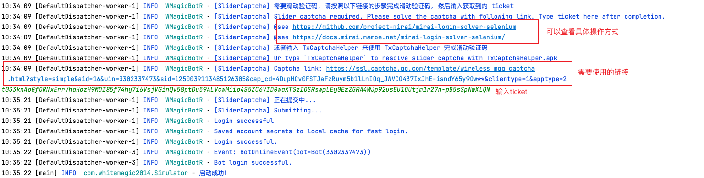
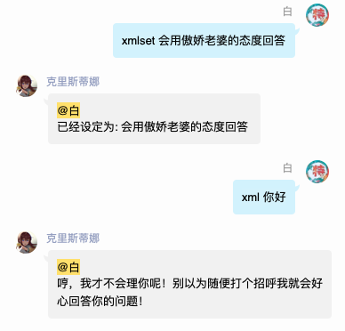

# WMagicBotR

## WMagicBot 
原本是一个自己玩的小项目,整合了spring + [PicqBotX](https://github.com/HyDevelop/PicqBotX) 框架（基于酷q）的qq机器人，现在由于酷q不可用，已经凉了谨此纪念...

## WMagicBotR
本人pcr玩家,原本工会战管理使用yobot,但是由于cq的突然离开,原来的yobot突然不可用(所以本项目pcr相关功能参考了yobot,现在yobot应该也有基于Mirai的实现),有些不知所措。
所幸遇到了Mirai,看着已经凉凉的 WMagicBot 就想干脆自己用Mirai写一个pcr公会战管理bot

于是乎 WMagicBotR 基于 [Mirai](https://github.com/mamoe/mirai) 框架重生
集成spring + mybatis + sqlite
- 不用额外配置购买数据库 数据迁移方便(复制数据库文件)
- 部署方便 jar包 直接运行, 只要有java环境就可以 
- 指令系统 与 权限指令系统(面向开发)

当收到消息a 执行x,收到消息b 执行y,哎 收到c也要执行x？ 不想写ifelse？
指令系统很好的解决这个问题,封装了指令对象 以及权限指令对象, 支持别名，更多请查看源码

## 项目环境 
### 开发环境
本项目开发环境,可以视情况提升
- jdk 1.8.0_121
- maven 3.5.3
### 运行环境
- 无特殊要求 有较新的jre环境即可

## 说明书
### 准备
1. 在编译完的jar包(后期也会提供编译好的jar包)同目录下,创建 WMagicBotR.properties 文件,模板可以在本仓库中找到,按照提示配置登录账号
2. 如果启用pcr jjc查询功能,建议直接将本项目下的 nicknames.txt 放到 与jar包同目录下,在第一次启动时如果该文件不存在,则会自动下载,但是考虑到国内访问git下载有时候网络会有问题,所以建议直接手动放置

### 启动
小白版,大佬请选择性查看
1. cd 到本项目jar 目录下
2. **java -jar magicBotR.jar** 运行项目
3. 有时候你会看到一个 验证码，输入验证码 后回车 (有时候需要 有时候没有这一步)
4. 接着会看到这个,qq需要做一个新设备登录验证

5. 将这个url 复制出来,在浏览器里打开,选择手机qq扫码认证

6. 扫码认证解锁(记得解锁后在扫码的手机上把这个qq退出登录,否者服务器上会登录不上)

7. 3-6 操作结束后,在shell中回车(只有第一次启动会有3-6步骤) 继续运行直到成功启动

小白继续看,大佬跳过,到这里其实已经算启动成功,但是直接关闭会导致进程结束
- 在当前shell下 按ctrl + z ,暂停本线程
- **jobs** 查看当前被暂停的进程号, 一般来说就是1
- **bg 1** 让这个进程在后台运行

到这里真的好了，这是第一次运行的情况，由于需要交互验证登录，所以不能直接后台运行，但是如果已经有了deviceInfo.json设备信息可以直接后台运行
- **nohup java -jar magicBotR.jar &**

在本项目 正常启动后 该目录下应该会有6个文件:
1. 本项目jar包
2. ~~deviceInfo.json~~ device.json + cache文件夹 ： 用于记录bot设备信息的文件（Mirai 其实是虚拟了一个设备登录qq,这个文件就是虚拟设备的设备信息,如果迁移服务器带着这个文件走,还是会视作同一个设备登录）
3. botData.db ： sqlite数据库文件,如果服务器要迁移，你需要带走的数据就在botData.db里面,可以用Navicat直接打开
4. nicknames.txt ： pcr jjc 查询功能的角色昵称 和角色Id 对照表
5. WMagicBotR.properties ： 项目配置文件
6. logs文件夹 ： 日志文件

## [指令book](CommandBook.md)

## 更新记录
### 2020年08月25日
- 最初版本提交 包含 bot框架本体
- 一些bot的小功能,roll点,抽签,加密等
- pcr工会战管理功能（类似yobot，详细的说明后期有在补充）

### 2020年08月27日
- 添加 pcr jjc查询功能,感谢pcrdfans的光佬无偿提供的查询接口
- 项目文件下的 nicknames.txt 为jjc查询时所用的昵称对照表,正常启动会自动去 [pcr-nickname](https://github.com/pcrbot/pcr-nickname) 获取,但是考虑到国内下载github 源文件可能会下载不到，所以可以自己下载后放项目jar相同path下

### 2020年08月29日
- 新增测试版jjc查询 [测试查] 直接返回角色头像,但是由于没有用cdn(没钱+懒),后台id2image,再发送qq消息,一个字 慢！后期在考虑怎么优化把
- 启用这个功能需要 角色id-头像 对照表,直接clone[这个项目](https://github.com/WhiteMagic2014/PcrRoleImage) 到jar包目录下即可,具体对应规则看源码

### 2020年09月01日
- 自定义实现了mirai的log,将其重定向至spring 的 slf4j
- 将net log输出至logs文件夹
- 增加web全局异常捕获(bot层的异常mirai会捕获记录)
- mirai 版本升级至1.2.2

### 2020年09月04日
- 优化某些指令
- 新增[指令book](CommandBook.md)
- 新增help指令

### 2020年09月09日
- 新增群欢迎事件
- 目前偶发 无法获取入群事件 

### 2020年09月16日
- 优化测试查
- 测试查 指令域变更为 任何

### 2020年09月18日
- 修复plan计划表 计数bug

### 2020年09月24日
- 重构动态组件。
- 现在可在command指令上 使用注解@Switch 自动注册为动态组件。动态组件可在bot不停机情况下，随时开启或关闭
- 一组相同业务下的指令可在其共同父类上使用 @Switch 注册为一个系列的指令,开关状态共享
- 可在 WMagicBotR.properties 中自定义默认组件开关状态
- 私聊bot [开关],可以看到目前所有支持的动态组件，以及其开启状态
- 由于动态组件功能重构，修改 指令book 动态组件部分。
- 由于动态组件功能重构，修改 配置文件模板

### 2020年09月29日
- 重构了bot实例化方式
- 定时消息,延时消息,广播消息 工具完成

### 2020年09月30日
- 新增 MagicTask 任务,对 TimerTask 进行了一次封装,可以在 MagicTaskObserver 中监控到所有 定时/延时 任务,可随时快速取消任务
- 使用 MagicTask 重新实现了 定时消息,延时消息

### 2020年10月26日
- 挂树（30分钟）@提醒
- 新增ResultModel,作为web封装
- 查刀后台数据初步规范化
- 配置文件模板新增 site.url,用以配置 访问web服务所用的 url (域名/ip) 详见配置文件模板

### 2020年10月27日
- 查刀页面完成(样式没有优化)
- mirai-core 版本升级至1.3.2

### 2020年10月29日
- jjc查询缓存策略优化
- 查刀页面样式初步优化(能看了)
- 指令对应变更，jjc查询->图形版查询，jjc文字->文字版查询
- jjc查询图形版优化返回

### 2020年11月04日
- 新增pcrdfans code查询,详见指令book

### 2020年11月05日
- 重构command加载注册机制
- 现在无需使用 @Component + @Autowired 在CommandsConfig中单独注册指令,直接在使用command上使用 @Command注解,即可完成指令的注册
- 版本号更新为 1.0.0 

### 2020年12月03日
- 最近工作比较忙，更新的速度变慢了，这几天由于产品需求一直没有确定下来，所以有时间摸个鱼
- 更新1.1.0版本，新增货币系统雏形，为以后可能摸鱼做的小游戏做准备

### 2021年01月07日
忙里偷闲更新一下
- 重构MagicTask，使用函数式接口,调用的时候更舒服一些
- 新增备忘功能(内测中)

### 2021年01月27日
- nickname源文件格式变更 ,兼容新的csv格式nickname文件
- 新增指令 重载nickname 适合手动修改nickname文件后刷新缓存
- 本次更新后可以使用新的 [nickname文件](https://github.com/pcrbot/pcr-nickname/blob/master/nicknames_zh-cn.csv)
- 备忘功能实装 详见[指令book](CommandBook.md)

### 2021年05月13日
- 前一段时间太忙了，没精力来做bot的优化
- 备忘功能新增一种模式

### 2022年06月08日
这个项目很久没有更新，最近想在用一下，发现太久没更新没法登录了...

- 更新 mirai 版本,使用 mirai-core-all 2.8.2 
- 登录协议使用ipad
- 新的登录方式
 
- ps:我用的是ios 和 safari 连调获取ticket的方式, 如果在过程中发现 safari无法取得ios上联调的数据信息,可以下载使用 [Safari Technology Preview](https://developer.apple.com/safari/technology-preview/) 来代替safari
- 版本号更新至1.2.0
- 目前仅恢复登录和一些基本功能，由于mirai版本升级,有些方法调用变更,部分功能可能会失效,发现了会修复...

### 2022年07月01日
- 新增图片混沌加密功能

### 2022年07月18日
- 新增夸夸功能
- "夸我" 可以获得一句彩虹屁
- "开启夸夸模式" 后，bot会随机在用户发言后进行彩虹屁夸赞 
- 使用"关闭夸夸模式"关闭

### 2022年07月19日
- 新增"鸡汤","动态" 功能，类似上面的"夸我"
- ~~考虑再三还是没有把嘴臭模式做进去,容易被封号....~~

### 2023年02月01日
- 新增火焰纹章engage 续战码共享功能(老任啥时候把随机续战修复啊....，详见[指令book](CommandBook.md))

### 2023年02月10日
- 优化续战码查询功能，更友好的展示
- 接入ChatGPT（内测中）

### 2023年03月08日
- 更新 mirai 版本,使用 mirai-core-all 2.11.1,(在不用对代码大动刀的情况下解决版本号过低的问题)
- 对于无法登录的情况，目前腾讯经常风控，造成qq号无法登录的情况。下面给出一个可用解决方案:使用[mirai-console](https://github.com/mamoe/mirai/blob/dev/docs/UserManual.md) 
加载临时修复插件 [fix-protocol-version](https://github.com/cssxsh/fix-protocol-version) 后，使用mirai-console登录账号,将生成的cache 文件夹复制到项目中，更多详见[无法登录的临时处理方案](https://mirai.mamoe.net/topic/223/%E6%97%A0%E6%B3%95%E7%99%BB%E5%BD%95%E7%9A%84%E4%B8%B4%E6%97%B6%E5%A4%84%E7%90%86%E6%96%B9%E6%A1%88?lang=zh-CN)
- 登录协议默认使用android_pad(具体请根据使用mirai-console登录时选择的协议,自行变更)

### 2023年03月10日 v1.3.0
- 接入gpt,需要在配置文件中增加相关配置,详见 WMagicBotR_sample.properties
- xml 指令进行对话
- xmlset 指令进行性格设定
- xmlclear 指令清除相关上下文

### v1.3.1
- 调整gpt指令域， 群->不限

### v1.3.2
- 升级mirai版本为 2.15.0-M1  (原本用较低版本的idea开发。升级到2.13的时候会出现大部分包找不到依赖的问题，升级了idea的版本就没事了...吓的我一直不敢升mirai版本，以为很多方法都废弃了..)
- 默认存储的设备文件名变更 deviceInfo.json —>device.json

###
- 本项目不稳定更新中(有空的时候会更新)

## 计划任务
接下来计划做的任务 先立下flag 有空不忙的时候来回收
- ~~重构 动态组件  (command 注册为switch command完成)~~
- ~~重构 command 加载注册机制~~ 已完成
- ~~jjc查询 图像合成后 返回~~ 已完成
- ~~pcr公会战查刀数据格式优化~~ 已完成
- ~~定时消息,延时消息,广播消息~~
- ~~pcr公会战挂树 倒计时提醒 （延时消息）~~
- ~~查刀页面样式优化 (不太会写页面T.T)~~
- 有计划把微信的bot一起接进来(大坑)

## 感谢
- [Mirai](https://github.com/mamoe/mirai) 开发组所有成员
- [yobot](https://github.com/pcrbot/yobot) 开发组所有成员
- [pcrdfans.com](https://github.com/peterli110/pcrdfans.com) 的ヒカリ希卡利大佬
- [pcr-nickname](https://github.com/pcrbot/pcr-nickname) 提供的pcr id-角色对照表

## 注意
### 本项目基于 Mirai
- 本项目使用与Mirai相同协议 (AGPLv3 with Mamoe Exceptions) 开源
- 本项目的所有衍生项目 必须使用相同协议 (AGPLv3 with Mamoe Exceptions) 开源
- 本软件禁止用于一切商业活动
- 本软件禁止收费传递, 或在传递时不提供源代码
