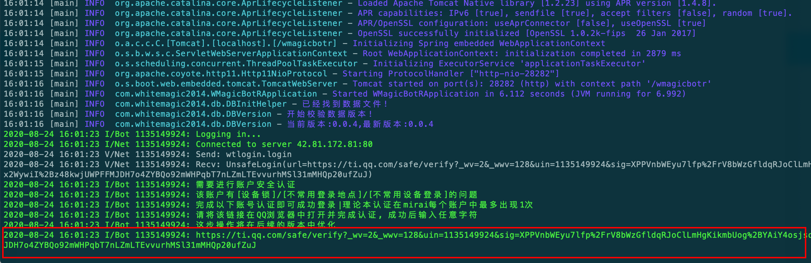
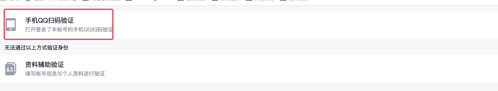
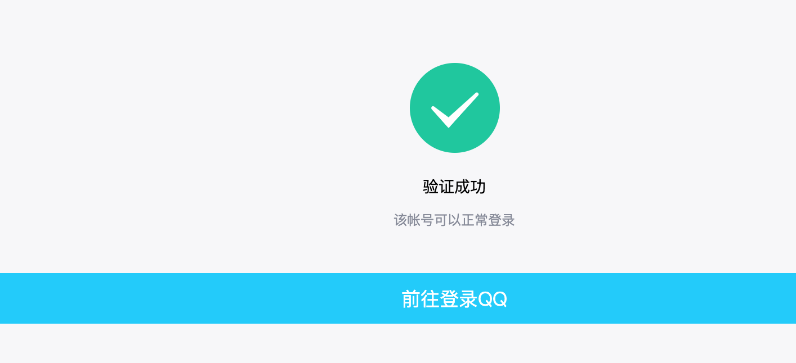
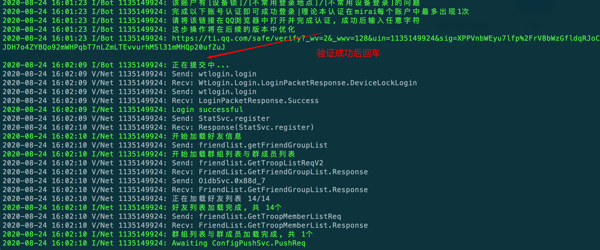

# WMagicBotR

## WMagicBot 
原本是一个自己玩的小项目,整合了spring + [PicqBotX](https://github.com/HyDevelop/PicqBotX) 框架（基于酷q）的qq机器人，现在由于酷q不可用，已经凉了谨此纪念...

## WMagicBotR
本人pcr玩家,原本工会战管理使用yobot,但是由于cq的突然离开,原来的yobot突然不可用(所以本项目pcr相关功能参考了yobot,现在yobot应该也有基于Mirai的实现),有些不知所措。
所幸遇到了Mirai,看着已经凉凉的 WMagicBot 就想干脆自己用Mirai写一个pcr公会战管理bot

于是乎 WMagicBotR 基于 [Mirai](https://github.com/mamoe/mirai) 框架重生
集成spring + mybatis + sqlite
- 不用额外配置购买数据库 数据迁移方便(复制数据库文件)
- 部署方便 jar包 直接运行, 只要有java环境就可以 
- 指令系统 与 权限指令系统(面向开发)

当收到消息a 执行x,收到消息b 执行y,哎 收到c也要执行x？ 不想写ifelse？
指令系统很好的解决这个问题,封装了指令对象 以及权限指令对象, 支持别名，更多请查看源码

## 项目环境 
### 开发环境
本项目开发环境,可以视情况提升
- jdk 1.8.0_121
- maven 3.5.3
### 运行环境
- 无特殊要求 有较新的jre环境即可

## 说明书
### 准备
1. 在编译完的jar包(后期也会提供编译好的jar包)同目录下,创建 WMagicBotR.properties 文件,模板可以在本仓库中找到,按照提示配置登录账号
2. 如果启用pcr jjc查询功能,建议直接将本项目下的 nicknames.txt 放到 与jar包同目录下,在第一次启动时如果该文件不存在,则会自动下载,但是考虑到国内访问git下载有时候网络会有问题,所以建议直接手动放置

### 启动
小白版,大佬请选择性查看
1. cd 到本项目jar 目录下
2. **java -jar magicBotR.jar** 运行项目
3. 有时候你会看到一个 验证码，输入验证码 后回车 (有时候需要 有时候没有这一步)
4. 接着会看到这个,qq需要做一个新设备登录验证

5. 将这个url 复制出来,在浏览器里打开,选择手机qq扫码认证

6. 扫码认证解锁(记得解锁后在扫码的手机上把这个qq退出登录,否者服务器上会登录不上)

7. 3-6 操作结束后,在shell中回车(只有第一次启动会有3-6步骤) 继续运行直到成功启动

小白继续看,大佬跳过,到这里其实已经算启动成功,但是直接关闭会导致进程结束
- 在当前shell下 按ctrl + z ,暂停本线程
- **jobs** 查看当前被暂停的进程号, 一般来说就是1
- **bg 1** 让这个进程在后台运行

到这里真的好了，这是第一次运行的情况，由于需要交互验证登录，所以不能直接后台运行，但是如果已经有了deviceInfo.json设备信息可以直接后台运行
- **nohup java -jar magicBotR.jar &**

在本项目 正常启动后 该目录下应该会有6个文件:
1. 本项目jar包
2. deviceInfo.json ： 用于记录bot设备信息的文件（Mirai 其实是虚拟了一个设备登录qq,这个文件就是虚拟设备的设备信息,如果迁移服务器带着这个文件走,还是会视作同一个设备登录）
3. botData.db ： sqlite数据库文件,如果服务器要迁移，你需要带走的数据就在botData.db里面,可以用Navicat直接打开
4. nicknames.txt ： pcr jjc 查询功能的角色昵称 和角色Id 对照表
5. WMagicBotR.properties ： 项目配置文件
6. logs文件夹 ： 日志文件

## [指令book](CommandBook.md)

## 更新记录
### 2020年08月25日
- 最初版本提交 包含 bot框架本体
- 一些bot的小功能,roll点,抽签,加密等
- pcr工会战管理功能（类似yobot，详细的说明后期有在补充）

### 2020年08月27日
- 添加 pcr jjc查询功能,感谢pcrdfans的光佬无偿提供的查询接口
- 项目文件下的 nicknames.txt 为jjc查询时所用的昵称对照表,正常启动会自动去 [pcr-nickname](https://github.com/pcrbot/pcr-nickname) 获取,但是考虑到国内下载github 源文件可能会下载不到，所以可以自己下载后放项目jar相同path下

### 2020年08月29日
- 新增测试版jjc查询 [测试查] 直接返回角色头像,但是由于没有用cdn(没钱+懒),后台id2image,再发送qq消息,一个字 慢！后期在考虑怎么优化把
- 启用这个功能需要 角色id-头像 对照表,直接clone[这个项目](https://github.com/WhiteMagic2014/PcrRoleImage) 到jar包目录下即可,具体对应规则看源码

### 2020年09月01日
- 自定义实现了mirai的log,将其重定向至spring 的 slf4j
- 将net log输出至logs文件夹
- 增加web全局异常捕获(bot层的异常mirai会捕获记录)
- mirai 版本升级至1.2.2

### 2020年09月04日
- 优化某些指令
- 新增[指令book](CommandBook.md)
- 新增help指令

### 2020年09月09日
- 新增群欢迎事件
- 目前偶发 无法获取入群事件 

### 2020年09月16日
- 优化测试查
- 测试查 指令域变更为 任何

### 2020年09月18日
- 修复plan计划表 计数bug

- 本项目不稳定更新中(有空的时候会更新)

## 计划任务
接下来计划做的任务 先立下flag 有空不忙的时候来回收
- 重构 动态组件
- ~~jjc查询 图像合成后 返回~~ 已完成
- 查刀数据格式优化

## 感谢
- [Mirai](https://github.com/mamoe/mirai) 开发组所有成员
- [yobot](https://github.com/pcrbot/yobot) 开发组所有成员
- [pcrdfans.com](https://github.com/peterli110/pcrdfans.com) 的ヒカリ希卡利大佬
- [pcr-nickname](https://github.com/pcrbot/pcr-nickname) 提供的pcr id-角色对照表

## 注意
### 本项目基于 Mirai
- 本项目使用与Mirai相同协议 (AGPLv3 with Mamoe Exceptions) 开源
- 本项目的所有衍生项目 必须使用相同协议 (AGPLv3 with Mamoe Exceptions) 开源
- 本软件禁止用于一切商业活动
- 本软件禁止收费传递, 或在传递时不提供源代码
